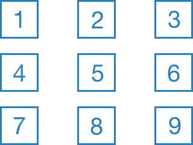

# QRCoder Chrome Extension

This extension can generate QR codes from the URL, selected text or links of the current website.

## Features

###  Generate QR code for the current website URL

On startup QRCoder generates a QR code for the current website URL. You can trigger this manually by clicking the home button  in the toolbar or with the keyboard shortcut ALT+H.

###  Generate QR code on text selection change

QRCoder can generate QR codes for selected text of the current website. QR code generation is trigged only by text selection changes. You can (de-)activate this behavior by clicking the text selection button  in the toolbar or with the keyboard shortcut ALT+T.

###  Generate QR code on hovering links

QRCoder can generate QR codes for link URLs when you hover over them with your mouse. You can (de-)activate this behavior by clicking the link button  in the toolbar or with the keyboard shortcut ALT+U.

###  Lock current QR code

You can (un-)lock the current QR code by clicking the lock button  in the toolbar or with the keyboard shortcut ALT+L. Locking prevents QR code generation by changing the selected text or hovering over links.

### Change QR code position

You can change the QR code position by hitting SHIFT and an arrow key on your keyboard. The following 9 positions (also accessible by keyboard shortcuts) are possible:

| position | vertical | horizontal | Keyboard Shortcut |
| -------- |----------|------------|-------------------|
| 1        | top      | left       | ALT + 1           |
| 2        | top      | center     | ALT + 2           |
| 3        | top      | right      | ALT + 3           |
| 4        | middle   | left       | ALT + 4           |
| 5        | middle   | center     | ALT + 5           |
| 6        | middle   | right      | ALT + 6           |
| 7        | bottom   | left       | ALT + 7           |
| 8        | bottom   | center     | ALT + 8           |
| 9        | bottom   | right      | ALT + 9           |

###  Fullsize QR code

The fullsize button  in the toolbar (or the keyboard shortcut ALT+F) generates a full sized QR code. You can exit the fullsize view by hitting the ESCAPE key or by clicking the fullsize button or by hitting ALT+F again.

### Statusbar

Below the generated QR code you can find a statusbar which shows the current QR code source ( = current website URL,  = selected text,  = hovered link url) and value (maybe truncated).

## Credits

The QR code generation part of this extension uses [QRCode.js](https://github.com/davidshimjs/qrcodejs) by [davidshimjs](https://github.com/davidshimjs).

## License

This project is under [MIT License](LICENSE).
